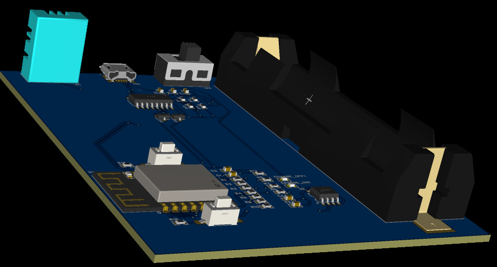
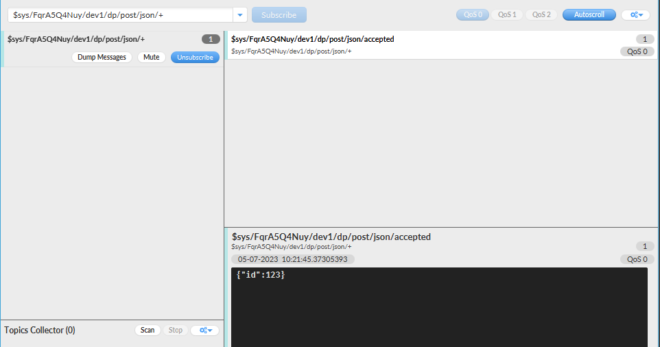

# 汇报文档

## 比赛内容

本文档针对2023年第六届-全国大学生嵌入式芯片与系统设计竞赛应用赛道-龙芯中科技术股份有限公司命题-选题方向5：工业无线物联网传感系统。官方文档给出的实现思路：

1. 基本思路
   - 完成至少三个的节点设计，能实现环境温度、湿度、光强数据实时采集并显示出来。
   - 完成终端的设计，具备以下功能：
     1. 全部的终端操作应在图形化的GUI上实现
     2. 能够分别查看每个节点的每项传感数据
     3. 能够查看每个数据系统时间变化的波形图，数据上报间隔不大于3秒
   - 节点与终端采用无线连接如WiFi、zigbee等，终端能够实时查看每个节点的在线情况以及上线、下线日志。掉线和上线测试的反应不超过3秒
   - 终端能对多节点的数据进行分析，实时发现温度、湿度、光照异常的节点，并在终端上报警
   - 终端可以将节点数据上传到云端，可使用现成的物联网云平台，如阿里云、OneNET等，也可以自己搭建，可以远程在手机或者电脑上查看节点数据。终端的所有报警信息可以以短信、邮件等形式实时发送到手机
2. 拓展发挥部分
   - 节点采用锂电池供电，且具有充电管理功能，能够使用USB进行充电。节点能上报自身的电量并在终端显示出来，低电量时在终端报警
   - 自行设计节点的PCB并完成打板，PCB上印刷”龙芯配套工业无线物联网节点“字样
   - 终端能将传感数据与时间对应关系保存成txt或excel等格式并导出文件
   - 系统采用一体化设计，布线合理、标识清晰、外观整洁、界面优美
   - 设计报告包含方案部分的方案描述、比较与选择、系统相关参数设计、系统组成、原理框图与各部分电路图、系统软件与流程图、测试方案、测试结果完整性和测试结果分析，行文规范、结构严谨
3. 说明
   - 节点不允许使用市售现有产品
   - 节点的MCU可以自行选择，可使用自带无线的MCU或者普通MCU加无线模块，尽量使用低成本和低功耗方案
   - 节点数据异常是指某个节点的传感器数值和其他的节点相比过高或者过低，以及如火灾、进水等传感器数据异常报警
   - 手动开关节点模拟测试上下线的功能，更换不同电量的电池测试电量检测上报功能
   - 远程查看数据是指通过云端以互联网进行数据查看而非本地连接，自行搭建物联网服务器也需要能够远程访问
   - 自行绘制的PCB尽量使用基本的元器件而不是对现成的模块进行整合

## 项目实现

### 框图


### 框图说明

本文档的说明内容即框图所示通信系统，众多传感器的数据信息从传感器节点通过WiFi传输到中心系统板上，系统板通过连接MQTT物联网云服务器，将传感器信息上传到云端服务器（此处为OneNet平台），然后手机通过云端服务器的API获取中心系统板上传的数据，即完成了赛题需求。

之后的内容将围绕框图内容展开更加详细的说明。

### 传感器节点

比赛要求不使用市售模块，故本文档会提供对传感器节点的设计、选型、使用说明。

#### PCB设计

本次比赛选用比较热门的物联网无线模块ESP-12F，其对应可参考的资料是ESP8266-NodeMCU开源硬件开发板，可以参考的NodeMCU电路图较多，此处随意选择一个以CH340为烧录芯片的版本。该图为开源内容，来源链接：[NodeMCU-ESP8266](https://docs.ai-thinker.com/esp8266/boards/nodemcu)。


PCB软件采用嘉立创EDA专业版，软件官网为[国产嘉立创EDA](https://pro.lceda.cn/)，使用过程全部免费，可选择在线版或者客户端版，推荐客户端版，同时下载嘉立创下单助手，可免运费下单打板PCB，软件官网为[嘉立创PCB下单助手](https://www.jlc.com/portal/appDownloadsWithConfig.html)。本文档的原理图根据以上开源原理图进行部分修改以符合比赛要求。

其中ESP-12F根据安信可、乐鑫提供的相关资料，对GPIO0、GPIO2上拉，对GPIO15进行下拉，在GPIO0端设计一个key用于在第一次烧写时锁定FLASH，完成第一次烧写的启动，之后依靠自动烧写电路进行烧写。

充电芯片根据TP4056提供的数据手册中的应用电路进行设计，详情可从立创EDA内跳转到数据手册。

DHT11因其在Arduino中的应用库较为完整，并且只需要一端数据线接入IO口，根据DHT11的数据手册设计图中应用电路。

烧写电路选择CH340C，其余型号可参考该系列芯片的数据手册选型，CH340C具有内置晶振，无需外部晶振，使用外部晶振时请牢记CH340手册中的警告与提示，以防使用错误的电容导致晶振无法顺利起振。其余内容为自动烧写电路。

电量测量电路使用ESP-12F的ADC端口测量模拟值，使用IO14进行测量电路的开关。

- PCB 3D渲染俯视图


- PCB 3D渲染侧视图



#### 节点使用说明

程序烧写可选择使用安信可官方提供的eclipse客户端，软件获取源：[ESP8266系列模组专题](https://docs.ai-thinker.com/esp8266)，或使用Arduino对ESP-12F进行烧录。本文档选用Arduino对节点进行烧录，部分工具需要从安信可官方官网获取，如需使用安信可提供的eclipse IDE请自行了解。

Arduino Github源地址：[arduino/arduino-ide: Arduino IDE 2.x](https://github.com/arduino/arduino-ide)，官网网站：[Software | Arduino](https://www.arduino.cc/en/software#download)内找到Nightly Builds下Windows按钮，点击just download即可获取exe文件。安装流程中如有故障（如断网需求、管理员权限、非中文路径）可自行依靠网络资源配置。此处直接跳转到ESP8266的库文件环境配置流程。

配置ESP8266WiFi库：打开Arduino-文件-首选项-设置-其他开发板管理器地址，输入内容为：```https://arduino.esp8266.com/stable/package_esp8266com_index.json```，点击确定后可尝试```#include<ESP8266WiFi.h>```或重启后再尝试，如此一来即可正常使用相关库。

使用ESP8266WiFi.h中的WiFIServer创建服务器对象，供客户端连接；使用WiFiClient创建客户端对象，供程序检测是否有客户端已连接。

使用DHT11.h中的```readHumidity```和```readTemperature```从传感器中读取温湿度数据。

其他问题可通过**文件-示例-包名**访问相关包的例程。

代码测试方式：通过串口烧录代码到ESP-12F的4MB FLASH中，按下reset按键，在Arduino中打开串口监视器，波特率与代码对应，可看到```connecting to wifi```等字样，连接成功后会通过串口给出节点在当前局域网下的IP，通过相同局域网内的客户端连接到该节点服务器时，节点会提示```client read nothing...```；当客户端发送指令"TH"时，会在客户端内接收到温度和湿度数据两个字符串，除数字外无其他指示信息。

### 中心系统板

中心系统板要求能够运行Qt的系统，如Loongnix64、LoongOS、Raspberry、Ubuntu、Windows等，此处先以Windows为例。

#### Windows安装Qt 5.14.2

清华镜像源：```https://mirrors.tuna.tsinghua.edu.cn/qt/official_releases/qt/```，打开任意版本的QT的offline_readme.txt可看到内容如下（我打开5.15.0）：

```c
Due to The Qt Company offering changes, open source offline installers are not available any more since Qt 5.15. Read more about offering changes in the https://www.qt.io/blog/qt-offering-changes-2020 blog.

If you need offline installers, please consider our new Qt for Small Business offering: https://www.qt.io/blog/available-now-qt-for-small-businesses
```

可看到自5.15版本起，开源的离线安装已经不支持了，那么为了方便开发就选择5.14的最新版本。（如下载更高版本，则得考虑可能会有付费问题和自行编译Qt creator问题）

下载得到可执行文件```qt-opensource-windows-x86-5.14.2.exe```，大小为2.28GB，下载时间较长，下载完成之后安装即可

安装完成之后可以看到QT众多的组成部分，如Assistant、Designer、Linguist、Qt Creator，其中除了Qt creator为4.11.1(Community)是唯一的，其余组成皆为一个编译器版本对应一个可执行文件

此时视为Qt已完成安装

- 编译QMqtt动态链接库（dll文件）

Github仓库链接：[qt/qtmqtt: Qt Module to implement MQTT protocol version 3.1 and 3.1.1](https://github.com/qt/qtmqtt)，选择与Qt对应的版本。仓库内把dev分支调整为5.14.2后再下载

下载完成后可用Qt Creator打开qtmqtt.pro文件，在Qt界面内可以看到examples、src、tests目录，src目录下有src.pro、mqtt目录，mqtt目录下有mqtt.pro、Headers、Sources、Other files目录，该内容为我们需要编译为动态链接库的内容。

点击Qt界面左侧的**项目**，配置如图。


图中首先需要取消勾选Shadow build，编译器版本可随意选择MinGW 64-bit或32-bit，图中选择64-bit，编译对象在左下角选择为Debug和qtmqtt_pub，点击第带Debug的运行按钮


此处编译时长为22秒，同时会打开一个cmd窗口，直接关闭即可。

打开windows的文件管理器，找到该Github仓库的本地路径（```F:\xxx\qtmqtt-5.14.2\qtmqtt-5.14.2```）

1. 复制lib文件下的.a文件和.prl文件到编译器的lib中（编译器路径通常为Qt安装路径），例如此处把两个文件放到```Qt\5.14.2\mingw73_64```的lib下；
2. 把.dll文件复制到编译器的bin路径下；
3. 把lib/cmake下的文件夹也复制到编译器的lib/cmake路径下；
4. 把mkspecs下的.pri文件也拷贝到编译器，如不存在对应的文件夹，可自己新建或直接把文件夹复制过去，命名不变即可；
5. 把include下的QtMqtt也复制到编译器的include目录下

结束编译QtMqtt的动态链接库，此时应可以在Qt中使用mqtt的库。

- 编写mqtt和socket客户端

在Qt Creator中选择**文件-New File or Project-Application-Qt Widgets Application**，点击choose后给项目命名，路径可以新开一个工作路径，选择好之后会出现**创建路径/名称/x.pro**等路径，**下一步**，qmake即可，Class name最好默认为MainWindow，常见的项目会采用该命名，熟练者可自己独立命名，故该界面可直接点击下一步，Translation File默认不变即可，Kits需选择已经复制粘贴过QtMqtt等相关编译文件的编译器，同时也可以包含其他版本的编译器，但是其他编译器不能使用mqtt，Summary直接点击完成即可。

得到如图所示界面：


然后在mainwindow.h中```#include<QtMqtt/qmqttclient.h>```等头文件

关于如何编写mqtt客户端的问题，可参考官方仓库[qt/qtmqtt: Qt Module to implement MQTT protocol version 3.1 and 3.1.1 http://mqtt.org/ (github.com)](https://github.com/qt/qtmqtt/tree/dev)下的路径```/examples/mqtt/```下的众多项目，该仓库之前编译mqtt的动态链接库时已下载了5.14.2的版本，链接会跳转至最新branch，或者参考好心人仓库[DanielLiMing/QtMqttClient: 使用QT创建的mqtt客户端，可用于mqtt的调试 (github.com)](https://github.com/DanielLiMing/QtMqttClient)等方式快速编写MQTT的客户端，好心人仓库内没有实现读取上行数据的反馈的部分，还是会依靠官方的example中的代码。


关于MQTT的说明参考后文。

Socket的客户端相对于MQTT会简单很多，主要使用Qt自带的QTcpSocket库。


关于TCP Socket通信的说明参考后文。

#### 龙芯派二代系统配置

1. 制作启动盘：使用镜像版本为```Loongnix-Embedded-20.1.rc2-loongarch64-DVD-1.iso```为2023年嵌入式比赛中上传到比赛QQ群的文件，与qq群中的手册说明的镜像不同，但启动盘制作方法与教程相同，可参考群文件**龙芯派二代用户手册_V1.4.1.pdf-5.1.2 安装Loongnix系统**章节内容

2. 安装Loongnix系统：将U盘和键盘插入龙芯派二代仅有的两个USB接口，不急着上电，龙芯派二代没有默认自带wifi，故可通过一根以太网线将龙芯派二代的eth0（靠近hdmi）与电脑以太网口连接，通过PC的wifi网卡共享网络到以太网口，可实现安装阶段接入网络；插入HDMI接口，等待显示屏亮起；第一项为选择中文安装，并且之后全为中文系统，配置内容主要包括全不硬盘安装系统、唯一root分区、主机名（hostname：默认debian）、root密码、用户账户名及密码、服务器域名（.cn等结尾，可随意设置）、网络安装镜像（默认填入mirror，不选择）、选择安装ssh+桌面+mate等软件（重点中的重点，所有软件通过空格选中，选择阶段按下enter键将开始安装，如未配置完成则需要等待安装完成后从头开始，耗时极长），最后会提示拔掉启动盘，在该界面拔出u盘后enter继续即可进入loongnix系统

3. 设置软件源：先```su```进入超级用户，```vim /etc/apt/source.list```，只添加deb，内容为```http://pkg.loongnix.cn/loongnix```，其余保持与文件相同，然后```apt-get update```和```apt-get upgrade```，时间较长，完成之后```apt-get install aptitude```，准备使用aptitude解决安装依赖问题

4. 配置SSH：安装系统阶段已安装ssh，先```su```进入超级用户，```vim /etc/ssh/sshd_config```，取消注释以下内容

   ```shell
   Port=22
   Protocol 2
   ListenAddress 0.0.0.0
   PermitRootLogin yes
   PermitEmptyPasswords no
   PasswordAuthentication yes
   ```

   与官方提供的书籍资料《用”芯“探核 龙芯派开发实战》不同，需要通过以下命令配置ssh：```systemctl enable ssh```完成开机自启的配置，```systemctl start  ssh```完成ssh启动，注意不能输入Systemctl；Windows通过共享网络会构建一个192.168.137.x的局域网，子网掩码为255.255.255.0，网关为192.168.137.1，通过```sudo ifconfig```查看龙芯派IP地址，因/bin下没有ifconfig，故sudo为必须内容；查询到ip地址后在PC端配置ssh连接即可成功通过ssh接入龙芯派，根据测试，关闭windows或重启龙芯派都不会改变该192.168.137.x的IP地址，无需考虑DHCP的问题

5. 配置VNC：参考树莓派配置VNC以及网络教程[Loongnix-server中vncserver服务使用方法](https://blog.csdn.net/qq_25650463/article/details/126674494)、[龙芯3A4000 vnc远程连接龙芯机](https://blog.csdn.net/a1171936767/article/details/104032863)、[TigerVNC安装使用](https://blog.csdn.net/dvd_sun/article/details/124531184)，进行以下操作

   ```bash
   aptitude install tigervnc-standalone-server
   #无需viewer
   passwd
   #设置一个密码即可，观看密码可不设置
   
   #此处可配置/home/username/.vnc/xstartup文件，配置方法可参考上文提及的链接，个人感觉不需要
   
   vncserver -localhost no :2
   #使用netstat -ntlp|grep vnc可得到0.0.0.0:5902，如果没有-localhost no就会出现127.0.0.1:5902，可参考netstat -ntlp|grep ssh得到的0.0.0.0:5902，如果为127.0.0.1是无法被外部设备访问的
   ```

   使用windows端的VNCviewer即可登录到龙芯桌面，但只是理论上可以，此处仍会报两个错，第二个错为```could not acquire name on session bus```，参考网络教程[终于明白vnc登录后could not acquire name on session bus错误的原因了](https://blog.csdn.net/weixin_30821731/article/details/98097697)中的红字可知，需要龙芯注销桌面端，此处我为了防止把系统弄崩溃，选择重启后不输入登录密码，然后在Windows端通过ssh登录到龙芯派，```vncserver -localhost no :2```，IP输入```192.168.137.159:5902```，然后输入自己设置的密码即可打开一个带有一定程度失真的远程桌面，此时已经可以拔掉龙芯派上的HDMI接口了。另外给出关闭vnc服务端的命令```vncserver -kill :2```;

#### 龙芯派二代交叉编译环境配置

安装虚拟机、配置Qt编译依赖、配置工具链可参考*树莓派交叉编译环境配置*，此处直接从交叉编译、编译qmake文件开始。

1. 交叉编译工具链测试：于虚拟机中使用loongarch64-gcc工具链编译出可执行文件，上传到龙芯派中，本次测试hello world，结果如图，交叉编译结果在虚拟机内无法运行；在龙芯派二代中可顺利运行

   

   

2. 配置交叉编译的qmake：参考视频链接[龙芯2k1000LA平台：Qt与文件编译配置](https://www.bilibili.com/video/BV1Ge4y197gk/?spm_id_from=333.1007.top_right_bar_window_history.content.click&vd_source=eb5f24bfe098bea8c8c9297b89e1bd81)，将qq群文件中的```poky-gblic-x86_64-my-qt5-image-loongarch64-ls3a5000-toolchain-3.3+snapshot.sh```文件传输到虚拟机中，赋予777权限并运行，所有选项都选择yes和默认路径即可，最终在/opt路径下出现poky路径，

   - 在路径```/opt/poky/3.3+snapshot/sysroots/x86_64-pokysdk-linux/usr/bin/qmake```下找到该qmake文件并配置到Qt creator的Qt Version中
   - 在路径```/opt/poky/3.3+snapshot/sysroots/x86_64-pokysdk-linux/usr/bin/loongarch64-poky-linux/loongarch64-poky-linux-gcc```下找到gcc
   - 在路径```/opt/poky/3.3+snapshot/sysroots/x86_64-pokysdk-linux/usr/bin/loongarch64-poky-linux/loongarch64-poky-linux-g++```找到g++

3. 配置Qt交叉编译环境：用上述qmake、gcc、g++组成Kit，在Qt中编译动态链接库、可执行文件；具体流程为

   - 在terminal中打开.pro工程文件路径，在该路径下执行指令`sudo source /opt/poky/3.3+snapshot/environment-setup-loongarch64-poky-linux`
   - 执行```qmake -v```查看qmake版本，要求输出内容为```QMake version 3.1 Using Qt version 5.15.2 in /opt/poky/3.3+snapshot/sysroots/loongarch64-poky-linux/usr/lib```
   - 完成上述步骤后，才能执行```qmake```，否则编译结果为x86平台程序，非交叉编译
   - ```make -j16```
   - 编译动态链接库无需`make install`
   - make之后可以在qtmqtt/include、qtmqtt/lib、qtmqtt/mkspecs下发现新生成的文件，将三个文件夹合并到```/opt/poky/3.3+snapshot/sysroots/x86_64-pokysdk-linux/usr```下的include、lib、mkspecs文件夹

4. 使用交叉编译的动态链接库交叉编译GUI程序：进入到GUI程序的.pro文件路径下，同上完成qmake环境使能、生成Makefile文件、编译，通常即可在路径下得到与项目名称相同的可执行文件

5. 转移sysroot环境：直接把上述编译生成的可执行文件传输到Loongnix中时，执行，报错：无法找到该文件；需要把.so文件从上位机中转移到下位机中，执行命令`rsync -avz lib pi@192.168.137.159:/home/pi/lib`

6. 传输完成动态链接库之后再在下位机上执行可执行文件，即可成功运行

### OneNet云端服务器

OneNet官网网址：[OneNET - 中国移动物联网开放平台 (10086.cn)](https://open.iot.10086.cn/)

在该平台注册一个账号，注册账号期间无注意事项。

在已登录的情况下回到上述链接界面，可以看到右上角由登录变为**开发者中心**，进入该界面可以看到左侧包含：**平台概览，产品开发，设备接入管理，数据流转，运维监控，增值服务**，本次配置MQTT云端服务器完全无需了解最后两项，即全免费。

可以在之前的MQTT客户端看到，登录OneNet平台的云端服务器是需要一些参数的，现在开始从产品开发操作界面获取相关参数。

点击左侧**产品开发-创建产品**，选择产品品类随意，选择智能化方式选择设备接入，不选择产品智能化；产品名称尽量短、尽量用英文，所属地市随意，节点类型选择直连设备，接入协议选择MQTT，数据协议选择**数据流**，联网方式选择**其他**，开发方案选择自定义方案，剩余信息可不填，点击确定。在**我的产品**中看到刚才生成的产品，MQTT客户端首先需要的是产品名称下的**产品ID**，此时开发状态为**开发中**（最终应当为**已发布**），点击右侧**操作**下的**设备管理**，跳转到**设备接入管理-设备管理**下，点击添加设备，所属产品不变，设备名称自行设定，要求简明扼要，设备名称就是MQTT客户端需要的第二个参数，应当为英文，其余信息随意。此时已在设备列表中生成了一个设备，设备状态为**未激活**（最终应当为**离线**或**在线**）。返回**产品开发**，点击右侧**操作-产品开发**，数据流模板-创建模板，数据流名称无所谓，按照要求任意取名，向下滑动网页，点击下一步，出现**设备开发，Topic管理，远程配置，自动注册设备**等选项，可点击Topic管理-数据流topic，可以看到Topic权限下有MQTT客户端之后会用到的**Topic发布指令模板**，该模板也有语法，后文会提到。回到**设备开发**标签下，点击下一步，点击发布，点击设备管理。右侧**操作-详情**，可以看到**设备信息**下有设备ID，设备密钥，其中设备密钥为MQTT客户端需要的中间关键信息，可以复制并备份起来。此时云端设备已经准备完毕，等待MQTT客户端连接。

获取MQTT客户端连接云端服务器所需的参数：

1. Profile Type:MQTT Broker

2. Broker Address:mqtts.heclouds.com

3. Broker Port:1883

4. Client ID:设备名称

5. MQTT Version:3.1.1

6. User Name:产品ID

7. Password:token

   - token是OneNet搞的接入安全认证参数，相关文档可通过**开发者中心**界面右侧**开发文档-最佳实践-MQTT接入**进行进一步翻阅，或者根据[接入安全认证](https://open.iot.10086.cn/doc/v5/develop/detail/624)进行跳转。简单地说就是密码是算出来的，算法需要一个token计算器和几个参数，进入上述链接之后下滑到文档底端可以看到**3.Token生成工具**下有下载链接，可获得token.exe，该计算器需要三个参数，依次如下：

     1. res=products/产品ID/devices/设备名称
     2. et=密码到期时间戳，生成方式见后文
     3. key=设备密钥

     method默认md5即可，version无法修改；et获取方式为进入在线的时间戳转换工具，这里随意提供一个链接：[时间戳(Unix timestamp)转换工具 - 在线工具 (tool.lu)](https://tool.lu/timestamp/)，把**时间**修改为**你希望的密码到期时间**，将该参数填入et中，点击token.exe右侧的生成按钮可以得到一个非常长的字符串

登录MQTT服务器，此处使用OneNet文档内演示所使用的MQTT.fx。

进入MQTT.fx软件后点击connect前面的**设置齿轮**，填入上述的参数，其他参数随意或默认即可，点击OK或apply，回到软件主界面点击connect，Publish下可输入Topic发布指令和数据流内容，Subscribe下可输入订阅Topic内容。

1. Publish所需信息：
   - 数据流Topic：**开发者中心-产品开发-操作-产品详情-下一步-Topic管理-数据流topic**，可以看到所有可使用的数据流Topic，个人将其视为指令；相关说明可在OneNET开发文档-MQTT物联网套件-数据点topic簇页面查看，传送门：[数据点topic簇_开发者文档_OneNET (10086.cn)](https://open.iot.10086.cn/doc/mqtt/book/device-develop/topics/dp-topics.html)；
   - 设备数据点上传：json格式，相关说明在上述传送门页面中
2. Subscribe所需信息：
   - 数据流Topic：同上，略有区别，均在文档中有说明

测试流程：

- Connect；
- Subscribe-输入数据流Topic-Subscribe，QoS 0即可，在左侧显示已订阅；
- Publish-输入数据流Topic-输入设备数据点上传内容（首次测试可使用极简测试单节点）-Publish，QoS 0即可；
- Subscribe-右侧显示accepted；
- 保持软件状态，打开OneNET开发者中心-设备接入管理-设备管理，可以看到设备状态由**未激活**变为**在线**

数据上行流程已完成，以下为数据下行流程；

参考OneNET官方文档[查询设备数据点](https://open.iot.10086.cn/doc/v5/fuse/detail/1431)可知：查询设备数据点需要向服务器API发送GET请求，官方提供的请求示例为

```javascript
GET http(s)://iot-api.heclouds.com/datapoint/history-datapoints?product_id=XhONWQ5zV5&device_name=mqtts-dev&datastream_id=ds&start=2017-01-01T00:00:00&limit=100
```

需要注意的是，接入安全认证参数导致的加密方式需要写在headers当中，格式如下：

```python
    headers = {
        "Authorization":"version=2018-10-31&res=products%2FFqruy%2Fdevices%2Fd&et=190815&method=md5&sign=RP9dvBo6ozG2g%3D%3D"
    }
```

空格等相关信息无关紧要，按照此格式发出GET请求即可获取到响应信息，官方给出的响应示例如下：

```json
{"data":{
    "cursor":"25971_564280_1448961152173",
    "count":5,
    "datastreams":[{"datapoints":[
        {"at":"2015-12-01 17:10:24.981","value":"35"},
        {"at":"2015-12-01 17:10:53.406","value":"38"},
    ],"id":"3200_0_5501"}]
},
 "request_id": "a25087f46df04b69b29e90ef0acfd115",
 "msg": "succ",
 "code":  0
}
```

可以看到本次比赛所需的信息在```data-datastream-datapoints-at```和```value```中，直接获取即可。

以上为OneNET云端服务器的数据配置、获取与使用方法。

### 手机终端

按照前文所述，手机只需要发出GET请求即可从云端服务器获取到中心系统节点上传的数据信息，本文档选择在手机终端中配置python环境以发出GET请求，进一步深化时可考虑直接进行Android开发。

适应本人开发习惯，故直接在手机上配置Terminal终端环境，然后补充python环境以运行脚本。

- 配置Terminal

要求Android 7.0以上的平板或手机，经实际安装可知该软件的硬盘空间要求为2G左右，如需通过Terminal配置其他环境则会扩大硬盘空间的占用情况。

下载地址：[Termux | F-Droid - Free and Open Source Android App Repository](https://f-droid.org/en/packages/com.termux/)，请注意，下载该软件无需下载F-DROID，目前最新版本为2022-01-11更新的0.118.0版本的软件，直接下载APK，通过数据线将软件从PC传输到手机中，无视风险安装即可。

python环境配置方法可参考教程：[如何在手机上配置 Python 环境](https://blog.csdn.net/BF02jgtRS00XKtCx/article/details/113976090)，需要的操作为**4.修改软件源，5.安装基本组件，三、Python包安装与配置**，其余内容可不配置，编译完成之后可输入```python -V```查看python版本，以及```python```后```import pandas```查看安装情况，其中matplotlib可能会编译失败，可不安装，本文档仅使用```requests```模块，如无法直接使用可尝试```pip install requests```即可。

# 额外说明

## MQTT协议说明

以下内容参考链接为[MQTT 入门介绍](https://www.runoob.com/w3cnote/mqtt-intro.html)，部分内容为本文档自行补充说明，并非纯原创。

### MQTT简述

MQTT（Message Queuing Telemetry Transport）是一种基于的发布/订阅模式的轻量级通讯协议，该协议构建于TCP/IP协议上，由IBM在1999年发布。MQTT最大优点在于可以以极少的代码和有限的带宽，为连接远程设备提供实时可靠的消息服务。作为一种低开销、低带宽占用的即时通讯协议，使其在物联网、小型设备、移动应用等方面有较广泛的应用。


### 设计规范

由于物联网的环境是非常特别的，所以MQTT遵循以下设计原则：

1. 精简，不添加可有可无的功能
2. 发布/订阅模式，方便消息在传感器之间传递
3. 允许用户动态创建主题，零运维成本
4. 把传输量降到最低以提高传输效率
5. 把低带宽、高延迟、不稳定的网路等因素考虑在内
6. 支持连续的会话控制
7. 理解客户端计算能力可能很低
8. 提供服务质量管理
9. 假设数据不可知，不强求传输数据的类型与格式，保持灵活性

### 主要特性

MQTT协议工作在低带宽、不可靠的网络的远程传感器和控制设备通讯而设计的协议，它具有以下主要的几项特性：

1. 发布/订阅消息模式提供一对多的消息发布，解除应用程序耦合，非常类似XMPP，但是MQTT的信息冗余远小于XMPP，因为XMPP使用XML格式文本来传递数据
2. 对负载（payload）内容屏蔽的消息传输
3. 使用TCP/IP提供网络连接
4. 有三种消息发布服务质量：“至多一次”，“至少一次”，“只有一次”
5. 小型传输，开销很小（固定长度的头部是2字节），协议交换最小化，以降低网络流量
6. 使用Last Will和Testament特性通知有关各方客户端异常中断的机制；Last Will即遗言机制，用于通知同一主题（Topic）下的其他设备“发送遗言的设备已经断开了连接”；Testament即遗嘱机制，功能类似于Last Will

其中MQTT主要特性的第二点在本次项目中有明显体现，主要表现形式为在MQTT客户端上以相同的账户和密码登录云端服务器之后，该账户如果再在其他设备上登录时会把当前账户强制下线，然而MQTT的发布与订阅都需要等登录账户，并且上次已订阅的主题需要每次重新登录时重新订阅，故**OneNet云端服务器-测试流程**中要求连接MQTT之后先订阅，再发布，同时在客户端内的订阅界面接收到发布内容的id的键值对，即消息ID，而无法接收到dp的键值对，即数据点内容，详情如图所示：



可以看到图中右下角仅有```{"id":123}```，而没有其他内容，然而发布内容如图所示：


可以看到发布内容还包含了```"dp":{"temp1":[{"v":30}]}```，此时可以看到MQTT的第二点特性：**对负载（payload）内容屏蔽的消息传输**，即对订阅端屏蔽了数据点内容，而该内容可以在OneNet网页客户端内和GET获取的json表单中获取。

因此此处继续补充说明MQTT协议原理。

### MQTT协议原理

#### MQTT协议实现方式

MQTT协议的实现方式需要客户端和服务器端通讯完成，在通讯过程中，MQTT协议中有三种身份：发布者（Publish）、代理（Broker）（服务器）、订阅者（Subscribe），其中消息的发布者和订阅者都是客户端，消息代理是服务器，消息发布者可以同时是订阅者。MQTT传输的消息分为：主题（Topic）和负载（payload）两部分：

- Topic可以理解为消息的类型，订阅者订阅后，就会收到该主题的消息内容（payload），上文已说明该payload指消息ID而非数据点内容。
- payload可以理解为消息的内容，指订阅者具体要使用的内容。

#### 网络传输与应用消息

MQTT会构建底层网络传输：它将建立客户端到服务器的连接，提供两者之间的一个有序的、无损的、基于字节流的双向传输。当应用数据通过MQTT网络发送时，MQTT会把与之相关的服务质量（QoS）和主题名（Topic）相关联。

#### MQTT客户端

基于以上说明，要求MQTT客户端满足以下要求：

1. 发布其他客户端可能会订阅的信息
2. 订阅其他客户端发布的消息
3. 退订或删除应用程序的消息
4. 断开与服务器的连接

#### MQTT服务器

MQTT服务器被称为消息代理（Broker），可以是一个应用程序或者一台设备，它位于发布者和订阅者之间，它可以：

1. 接受来自客户的网络连接
2. 接收客户发布的应用信息
3. 处理来自客户端的订阅和退订请求
4. 向订阅的客户转发应用程序消息

#### MQTT协议中的概念体

MQTT连接过程的概念体包括订阅、会话、主题名、主题筛选器、负载

- 订阅包含主题筛选器Topic Filter和最大服务质量QoS，订阅会与一个会话关联，一个会话可以包含多个订阅，每个会话中的每个订阅都有一个不同的主题筛选器（见下文图文补充说明）
- 会话即每个客户端与服务器建立连接后的对象，客户端和服务器之间有状态交互，会话存在于一个网络之间，也可能在客户端和服务器之间跨越多个连续的网络连接
- 主题名即连接到一个应用程序消息的标签，该标签与服务器的订阅相匹配，服务器会将消息发送给订阅所匹配标签的每个客户端
- 主题筛选器是一个对主题名通配符筛选器，在订阅表达式中使用，表示订阅所匹配到的多个主题
- 负载是消息订阅者所具体接收的内容


如图所示，多条```$sys/产品ID/设备名称/dp/post/...```等订阅内容即多个订阅以及每个订阅的不同主题筛选器，此处第一条```json/+```实际上已经包含了下边两条```json/accepted```和```json/rejected```，此处仅用于举例。

其他的概念体已经在上文中解释过，此处不再继续展开解释。

#### MQTT协议中的方法

至此可以看出MQTT协议中主要包含五个方法（或动作），即连接、断开连接、订阅、取消订阅、发布，MQTT客户端依靠五个方法完成对确定资源进行操作，资源可以代表预先存在的数据或动态生成的数据，这取决于服务器的实现，通常来说，资源指服务器上的文件或输出。

#### MQTT协议数据包结构

MQTT协议的数据包由固定头、可变头、消息体构成：

- 固定头结构为Byte 1中bits7-4指定MQTT数据包类型，Byte 1中bits3-0指定标识位，标识位包括DUP、QoS、RETAIN，Byte 2指定剩余长度；
- 可变头位于固定头和负载之间，因数据包类型而不同，较常的应用是作为包的标识；
- 负载消息体包含CONNECT，SUBSCRIBE，SUBACK，UNSUBCRIBE四种类型的消息，CONNECT包含客户端ClientID（同设备名称）、订阅的Topic、Message以及用户名（同产品ID）和密码（同token）

## Socket通信说明

以下内容参考链接为[基于TCP协议的Socket通信](https://www.runoob.com/w3cnote/android-tutorial-socket1.html)，部分内容为本文档自行补充说明，并非纯原创。

### Socket说明

Socket（套接字）用来描述IP地址和端口，是通信链的句柄，应用程序可以通过Socket向网络发送请求或者应答网络请求。Socket是支持TCP/IP协议的网络通信的基本操作单元，是对网络通信过程中端点的抽象标识，包含了进行网络通信所必须的物种信息：链接所使用的协议，本地主机的IP地址，本地远程的协议端口，远地主机的IP地址，远地进程的协议端口。

### Socket通信模型


Socket通信实现步骤解析：

1. 创建ServerSocket和Socket
2. 打开连接到的Socket的输入/输出流
3. 按照协议对Socket进行读/写操作
4. 关闭输入输出流，以及Socket

### Socket服务端

服务端工作步骤解析：

1. 创建ServerSocket对象，绑定监听的端口
2. 调用accept()方法监听客户端的请求
3. 连接建立后，通过输入流读取客户端发送的请求信息
4. 通过输出流向客户端发送响应信息
5. 关闭相关资源

本文档描述的系统中，Socket服务端建立在ESP-12F单片机上，并且使用Arduino进行开发，故对相关库函数进行进一步解析：

Arduino内主要使用```<ESP8266WiFi.h>```进行配置Socket，代码主要分为两部分：void setup和void loop，其中setup相当于bootloader，loop相当于系统，流程如下：

1. 在函数以外创建ServerSocket对象并绑定端口：```WiFiServer server(PORT)```
2. 在setup中启动：```server.begin()```，等价于调用accept()方法监听客户端的请求
3. 建立连接时```WiFiClient client=server.available()```为真，通过```client.readString()```输入流读取客户端发送的请求信息
4. 通过```client.write()```输出流向客户端发送响应信息
5. 通过```client.stop()```关闭相关资源

### Socket客户端

客户端工作步骤解析：

1. 创建Socket对象，指明需要链接的服务器的地址和端号
2. 连接建立后，通过输出流向服务器发送请求信息
3. 通过输入流获取服务器响应的信息
4. 关闭相关资源

本文档描述的系统中，Socket客户端建立在Linux系统上，并且使用Qt进行开发，故对相关库函数进行进一步解析：

1. 创建Socket对象（在```mainwindow.h```中的```MainWindow```类中定义私有```QTcpSocket```指针变量），指明服务器的地址和端口号（调用Socket对象时使用其```connectToHost```方法指明ip和port）
2. 连接建立后，通过Socket方法```write,flush,waitForBytesWritten```输出流向服务器发送请求信息
3. 通过Socket方法```readLine```输入流获取服务器响应信息
4. 关闭相关资源
